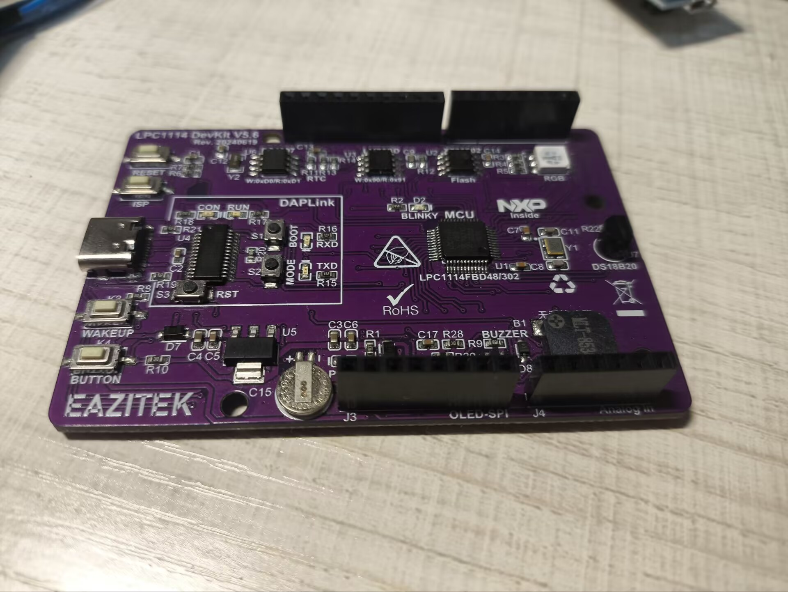
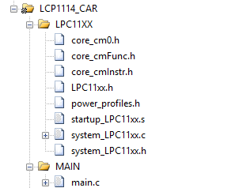
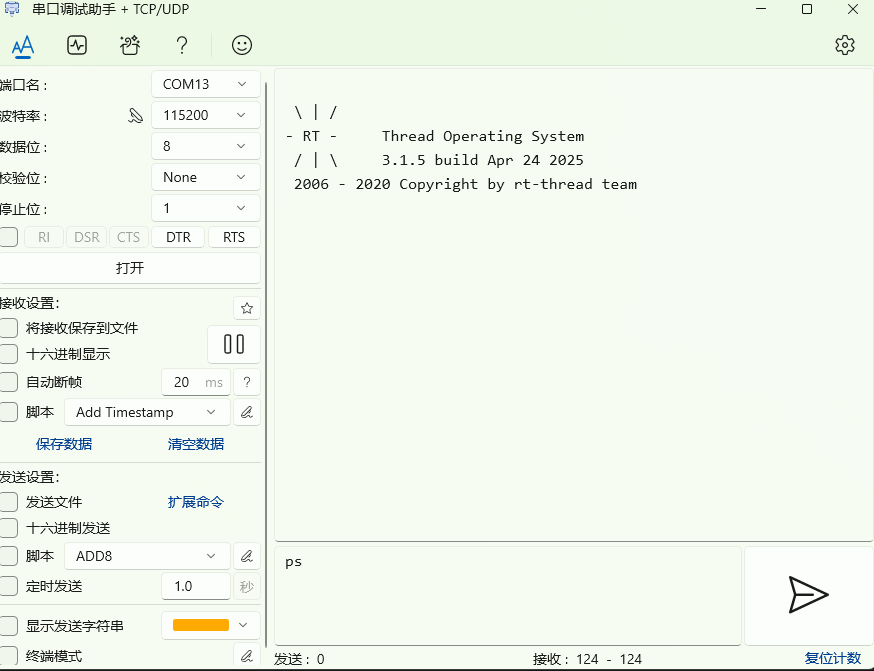

# 在LPC1114上移植 RT-Thread Nano 3.1.5

## 开发环境
- **IDE**: Keil5 5.38a（AC5编译器）
- **芯片**: LPC1114FBD48/302 （Cortex-M0  8KB/32KB）
- **开发板**: LPC1114 DevKit


## 前言

&emsp;&emsp;接触到了一款搭载有LPC1114芯片的开发板。虽然这款芯片不仅颇有一把年纪，而且产品力在当下井喷式发展的一众新式高性能、具有图形化GUI配置界面的嵌入式产品面前显得有些力不从心。但是玩了玩这款开发板之后，却又体味了一种"玩经典跑车的美"，仿佛又回到了那个嵌入式系统被芯片制程限制性能的年代。
&emsp;&emsp;考虑到后期会基于这块芯片开发一系列的包含通信、协同、控制等一系列可能会消耗大量性能的功能，做了这个LPC1114的RT-Thread Nano 3.1.5的移植教程，来进一步提高该芯片的性能利用率。

## 正题

&emsp;&emsp;其实官方也是有RT-Thread Nano的在Keil上的移植方法的文档的，但都是基于STM32的。对于NXP的芯片，而且是这种SDK年代非常久远的版本，教程是不太适用的。
在论坛上也有讨论过LPC1114移植的相关话题，但是是在2014年，并且可能因为考虑到这个芯片的年代、使用量、原厂支持等，RT官方后续也没有再对该芯片进行支持了。
&emsp;&emsp;后来自己尝试移植，借着一些自己对RTT的理解，对启动文件入口进行排查，对比ST的移植例程，最后完成移植。
&emsp;&emsp;注意：正确的食用方式：开着官方的nano在Keil上的移植例程对比阅读。

## 移植步骤

### 1.导入软件包

&emsp;&emsp;先根据官方的nano在Keil上的移植例程下载并导入nano软件包：[https://www.rt-thread.org/document/site/#/rt-thread-version/rt-thread-nano/nano-port-keil/an0039-nano-port-keil]

&emsp;&emsp;一个初始的LPC1114的SDK主要包含如下文件，该SDK类似于STM32的LL库，几乎85%面向寄存器进行开发。稍后我们在移植中需要用到的文件有`system_LPC11xx.c`和`startup_LPC11xx.s`。


### 2.调整启动顺序

&emsp;&emsp;这一点是LPC1114与官方移植过程中差别最大的。也是LPC1114移植nano藏得比较深的点了。初学者一般不会关注这个地方。容易导致系统移植失败。我们首先要进入在LPC1114的启动文件`startup_LPC11xx.s`找到函数入口。此处我们与stm32的启动进行对比。LPC1114的启动文件顺序和stm32并无区别。都是先进入`SystemInit`初步进行系统初始化，然后在跳转进入主函数。但是搭载RT-Thread的话，RTT自己的软件包写了重定义启动入口，所以不用管`__main`。

##### LPC1114的启动文件
```armasm
Reset_Handler   PROC
                EXPORT  Reset_Handler             [WEAK]
                IMPORT  SystemInit
                IMPORT  __main
                LDR     R0, =SystemInit				
                BLX     R0
                LDR     R0, =__main
                BX      R0
                ENDP

```
##### STM32的启动文件
```armasm

Reset_Handler    PROC
                 EXPORT  Reset_Handler             [WEAK]
     IMPORT  __main
     IMPORT  SystemInit
                 LDR     R0, =SystemInit
                 BLX     R0
                 LDR     R0, =__main
                 BX      R0
                 ENDP

```
&emsp;&emsp;真正的问题出在`SystemInit`上。让我们分别看看LPC1114和STM32`SystemInit`的区别。
##### STM32的`SystemInit`

```C
void SystemInit (void)
{
#if defined(STM32F100xE) || defined(STM32F101xE) || defined(STM32F101xG) || defined(STM32F103xE) || defined(STM32F103xG)
  #ifdef DATA_IN_ExtSRAM
    SystemInit_ExtMemCtl(); 
  #endif /* DATA_IN_ExtSRAM */
#endif 

  /* Configure the Vector Table location -------------------------------------*/
#if defined(USER_VECT_TAB_ADDRESS)
  SCB->VTOR = VECT_TAB_BASE_ADDRESS | VECT_TAB_OFFSET; /* Vector Table Relocation in Internal SRAM. */
#endif /* USER_VECT_TAB_ADDRESS */
}

```
##### LPC1114的`SystemInit`

```C
void SystemInit (void) {
  volatile uint32_t i;

#if (CLOCK_SETUP)                                 /* Clock Setup              */

#if ((SYSPLLCLKSEL_Val & 0x03) == 1)
  LPC_SYSCON->PDRUNCFG     &= ~(1 << 5);          /* Power-up System Osc      */
  LPC_SYSCON->SYSOSCCTRL    = SYSOSCCTRL_Val;
  for (i = 0; i < 200; i++) __NOP();
#endif

  LPC_SYSCON->SYSPLLCLKSEL  = SYSPLLCLKSEL_Val;   /* Select PLL Input         */
  LPC_SYSCON->SYSPLLCLKUEN  = 0x01;               /* Update Clock Source      */
  LPC_SYSCON->SYSPLLCLKUEN  = 0x00;               /* Toggle Update Register   */
  LPC_SYSCON->SYSPLLCLKUEN  = 0x01;
  while (!(LPC_SYSCON->SYSPLLCLKUEN & 0x01));     /* Wait Until Updated       */
#if ((MAINCLKSEL_Val & 0x03) == 3)                /* Main Clock is PLL Out    */
  LPC_SYSCON->SYSPLLCTRL    = SYSPLLCTRL_Val;
  LPC_SYSCON->PDRUNCFG     &= ~(1 << 7);          /* Power-up SYSPLL          */
  while (!(LPC_SYSCON->SYSPLLSTAT & 0x01));	      /* Wait Until PLL Locked    */
#endif

#if (((MAINCLKSEL_Val & 0x03) == 2) )
  LPC_SYSCON->WDTOSCCTRL    = WDTOSCCTRL_Val;
  LPC_SYSCON->PDRUNCFG     &= ~(1 << 6);          /* Power-up WDT Clock       */
  for (i = 0; i < 200; i++) __NOP();
#endif

  LPC_SYSCON->MAINCLKSEL    = MAINCLKSEL_Val;     /* Select PLL Clock Output  */
  LPC_SYSCON->MAINCLKUEN    = 0x01;               /* Update MCLK Clock Source */
  LPC_SYSCON->MAINCLKUEN    = 0x00;               /* Toggle Update Register   */
  LPC_SYSCON->MAINCLKUEN    = 0x01;
  while (!(LPC_SYSCON->MAINCLKUEN & 0x01));       /* Wait Until Updated       */

  LPC_SYSCON->SYSAHBCLKDIV  = SYSAHBCLKDIV_Val;
#endif
}
```

&emsp;&emsp;由此可见，32并未在`SystemInit`中定义自己的时钟配置，而是重新开了对应的`SystemClock_Config`，stm32的`SystemInit`执行的是更加底层的启动操作比如外挂SRAM初始化的配置之类的。如果提前启动时钟，那么在`__main`这里开始逐步跳转进入RT-Thread重定义的操作系统初始化入口时，就可能导致系统启动顺序错误。这也是笔者碰见的问题，后来一步步查下去，最后查到了启动文件头上。

 &emsp;&emsp;此处笔者开始有两种想法：
+ 重写一个`SystemClock_Config`,将LPC1114的时钟初始化移植过来，并且将`SystemInit`置为一个空函数。
+ 注释汇编里`SystemInit`的启动点，然后将`SystemInit`的函数入口放在正确的地方。
&emsp;&emsp; 笔者选择了前者，改写汇编或许会更快捷，但是保留`SystemInit`会对以后开发留有更多拓展性。
                    
&emsp;&emsp;在`system_LPC11xx`中重写`SystemClock_Config`并注释`SystemInit`中的内容。

```C
void SystemClock_Config(void)
{

 volatile uint32_t i;

#if (CLOCK_SETUP)                                 /* Clock Setup              */

#if ((SYSPLLCLKSEL_Val & 0x03) == 1)
  LPC_SYSCON->PDRUNCFG     &= ~(1 << 5);          /* Power-up System Osc      */
  LPC_SYSCON->SYSOSCCTRL    = SYSOSCCTRL_Val;
  for (i = 0; i < 200; i++) __NOP();
#endif

  LPC_SYSCON->SYSPLLCLKSEL  = SYSPLLCLKSEL_Val;   /* Select PLL Input         */
  LPC_SYSCON->SYSPLLCLKUEN  = 0x01;               /* Update Clock Source      */
  LPC_SYSCON->SYSPLLCLKUEN  = 0x00;               /* Toggle Update Register   */
  LPC_SYSCON->SYSPLLCLKUEN  = 0x01;
  while (!(LPC_SYSCON->SYSPLLCLKUEN & 0x01));     /* Wait Until Updated       */
#if ((MAINCLKSEL_Val & 0x03) == 3)                /* Main Clock is PLL Out    */
  LPC_SYSCON->SYSPLLCTRL    = SYSPLLCTRL_Val;
  LPC_SYSCON->PDRUNCFG     &= ~(1 << 7);          /* Power-up SYSPLL          */
  while (!(LPC_SYSCON->SYSPLLSTAT & 0x01));	      /* Wait Until PLL Locked    */
#endif

#if (((MAINCLKSEL_Val & 0x03) == 2) )
  LPC_SYSCON->WDTOSCCTRL    = WDTOSCCTRL_Val;
  LPC_SYSCON->PDRUNCFG     &= ~(1 << 6);          /* Power-up WDT Clock       */
  for (i = 0; i < 200; i++) __NOP();
#endif

  LPC_SYSCON->MAINCLKSEL    = MAINCLKSEL_Val;     /* Select PLL Clock Output  */
  LPC_SYSCON->MAINCLKUEN    = 0x01;               /* Update MCLK Clock Source */
  LPC_SYSCON->MAINCLKUEN    = 0x00;               /* Toggle Update Register   */
  LPC_SYSCON->MAINCLKUEN    = 0x01;
  while (!(LPC_SYSCON->MAINCLKUEN & 0x01));       /* Wait Until Updated       */

  LPC_SYSCON->SYSAHBCLKDIV  = SYSAHBCLKDIV_Val;
#endif
}

```


### 3.修改`board.c`


#### 3.1 此时根据教程我们需要在`board.c`中动刀 。

 &emsp;&emsp;首先我们要重定义`SysTick_Handler()`并删除其它位置的使用（如果有的话）。

```C 
    void rt_os_tick_callback(void)
{
    rt_interrupt_enter();
    
    rt_tick_increase();

    rt_interrupt_leave();
}

/* cortex-m 架构使用 SysTick_Handler() */
void SysTick_Handler()
{
    rt_os_tick_callback();
}
    
```
#### 3.2 设置`rt_hw_board_init()`下面采用对比法来解释说明:

&emsp;&emsp;lpc1114这边需要调用头文件`#include "system_LPC11xx.h"`。该文件主要是为了调用我们上述重写的`SystemClock_Config`该函数命名参考官方移植例程中32的`SystemClock_Config`其主要内容为系统时基定时器的配置。
此处由于LPC1114的SDK是基于寄存器开发，不需要初始化HAL库（硬件抽象层）,但是需要设置系统时钟的NVIC优先级，这个在32中是在` HAL_Init()`中定义的，一定注意。NVIC设置系统tick默认最低优先级。

##### LPC1114的`rt_hw_board_init()`

```C
 void rt_hw_board_init(void)
{
    /* 
     * TODO 1: OS Tick Configuration
     * Enable the hardware timer and call the rt_os_tick_callback function
     * periodically with the frequency RT_TICK_PER_SECOND. 
     */          
	  NVIC_SetPriority(SysTick_IRQn,15);	 	 
    SystemClock_Config();
    SystemCoreClockUpdate (); 

    SysTick_Config(SystemCoreClock / RT_TICK_PER_SECOND);

    /* Call components board initial (use INIT_BOARD_EXPORT()) */
#ifdef RT_USING_COMPONENTS_INIT
    rt_components_board_init();
#endif

#if defined(RT_USING_USER_MAIN) && defined(RT_USING_HEAP)
    rt_system_heap_init(rt_heap_begin_get(), rt_heap_end_get());
#endif
}
  ```
  
 ##### 官方STM32的`rt_hw_board_init()`
   ```C
   void rt_hw_board_init(void)
{
  /*
   * TODO 1: OS Tick Configuration
   * Enable the hardware timer and call the rt_os_tick_callback function
   * periodically with the frequency RT_TICK_PER_SECOND.
   */

  /* 1、系统、时钟初始化 */
  HAL_Init(); // 初始化 HAL 库
  SystemClock_Config(); // 配置系统时钟
  SystemCoreClockUpdate(); // 对系统时钟进行更新

  /* 2、OS Tick 频率配置，RT_TICK_PER_SECOND = 1000 表示 1ms 触发一次中断 */
  SysTick_Config(SystemCoreClock / RT_TICK_PER_SECOND);

  /* Call components board initial (use INIT_BOARD_EXPORT()) */
#ifdef RT_USING_COMPONENTS_INIT
  rt_components_board_init();
#endif

#if defined(RT_USING_USER_MAIN) && defined(RT_USING_HEAP)
  rt_system_heap_init(rt_heap_begin_get(), rt_heap_end_get());
#endif
}

   ```

#### 3.3 下面展示console功能的串口适配，串口重定向和串口驱动会放在例程里，请git仓库自取，此处不过多展示。声明：此处 `rt_hw_console_output`的写法参考了野火的教程攻略，感谢火哥开源。  

```C 
#ifdef RT_USING_CONSOLE

static int uart_init(void)
{
 //#error "TODO 2: Enable the hardware uart and config baudrate."
	 UART_init(115200);
    return 0;
}
INIT_BOARD_EXPORT(uart_init);

void rt_hw_console_output(const char *str)
{
  //#error "TODO 3: Output the string 'str' through the uart."
	 	
	/* 进入临界段 */
	rt_enter_critical();
	/* 直到字符串结束 */
	while (*str!='\0')
	{
		/* 换行 */
		if(*str=='\n')
		{
			UART_send_byte( '\r');
		}
		UART_send_byte( *str++);
	}
 		
	/* 退出临界段 */
	rt_exit_critical();
}

#endif
```
#### 3.4 这里要提一嘴串口重定向的事情,此处的`(uint8_t)`强制转换需要添加，NXP原厂例程里没加，在keil4中可正常使用，但是在keil5会乱码，笔者推测可能与编译器和C的标准有关。有大佬明白的还请指点。
``` C
/*----------------------------------------------------------------------------
  Write character to Serial Port
 *----------------------------------------------------------------------------*/
int sendchar (int c) {

  while (!(LPC_UART->LSR & 0x20));
  LPC_UART->THR = (uint8_t)c;

  return (c);
}


```
&emsp;&emsp;console串口移植效果



&emsp;&emsp;默认例程：LED灯和RGB灯分别闪烁,调试串口默认打开

## 项目源码仓库

    项目源码: https://github.com/DAMIAN-CHEN/LPC1114_RTT.git